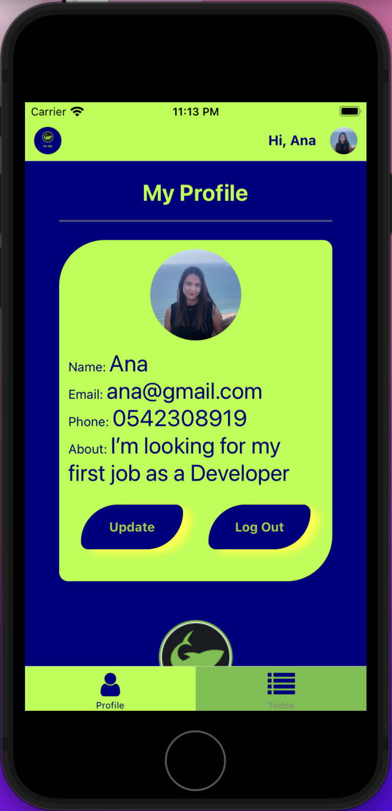
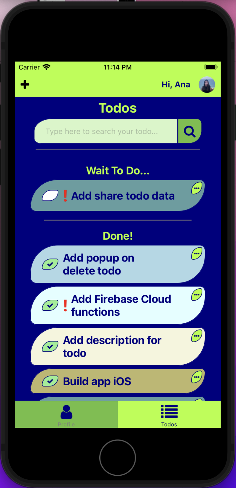

# To Do Mobile App 
My first mobile app using Expo, React Native, TypeScript, Firebase (Auth, Firestore, Storage, Hosting and Cloud Functions).  

### ToDo Cross-Platform App - explanation on Youtube - <a href="https://www.youtube.com/watch?v=5IBjLLmK5IA" target="_blanlk">link</a>   
Short DEMO iOS on Youtube - <a href="https://www.youtube.com/watch?v=XzioT_V3TTQ&ab_channel=AnaLevit">link</a>   
iOS Simulator Build - <a href="https://1drv.ms/u/s!AihaESy1H1s1gdwnCmJkcko3Cp19lg?e=RUJCPY">link</a>  
Expo publish - <a href="https://expo.dev/@anaalamed/todo">link</a>

Some Screenshots:  

    
      
      
      
      
      

